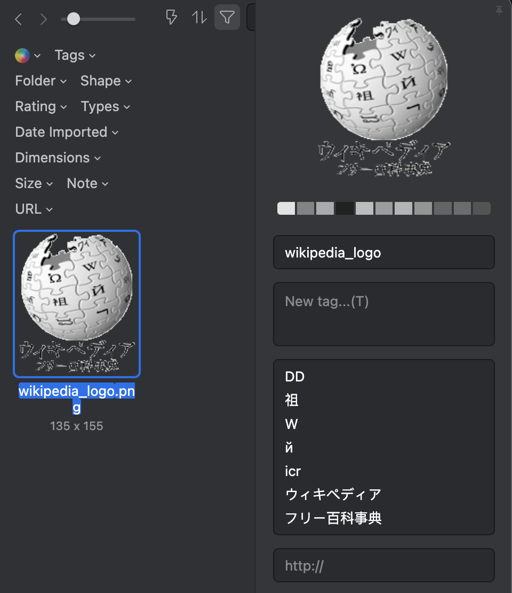

# Eagle OCR script

Add OCR text to `Notes...` attributes of images in [Eagle](https://en.eagle.cool/).

## Disclaimer

USE AT YOUR OWN RISK!
TAKE BACKUP OF LIBRARY BEFORE USE!

## Features



Image by [Wikipedia](https://upload.wikimedia.org/wikipedia/commons/e/e9/Wiki%E3%83%AD%E3%82%B4%E6%A1%88-%E3%83%95%E3%83%AA%E3%83%BC%E7%99%BE%E7%A7%91%E4%BA%8B%E5%85%B8.png)

- Write OCR text into Note attributes, which is easy to search
- Skip writing OCR text if Note already exists
- OCR is provided by [Cloud Vision API](https://cloud.google.com/vision), which supports many languages

## Prerequisites

- Google Cloud Platform (GCP) credential for calling Cloud Vision API 
- node (pnpm is preffered)

## Usage

Set up GCP credential, then type

```bash
pnpm install
pnpm run ocr <Images.library path>
```

Then, `Force Realod Library` in Eagle.
You can search images with OCR result.

## Considerations

- Approximately $1.5 per 1,000 images. If you want to filter some images out, modify code.
- Currently, there is no special deal with break lines. Removing BRs has pros/cons, so this topic is debatable.
